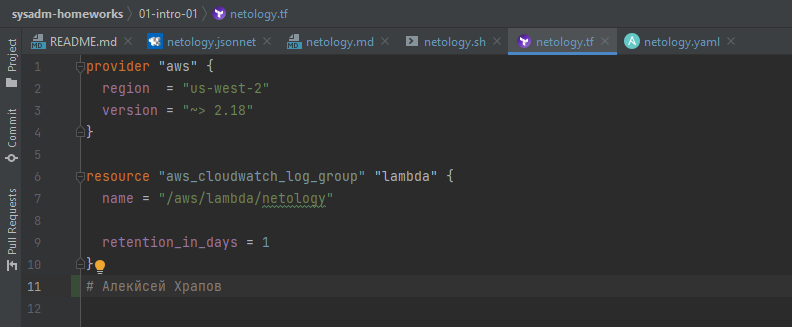
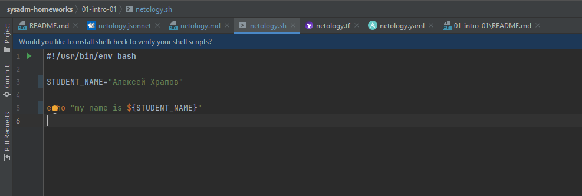
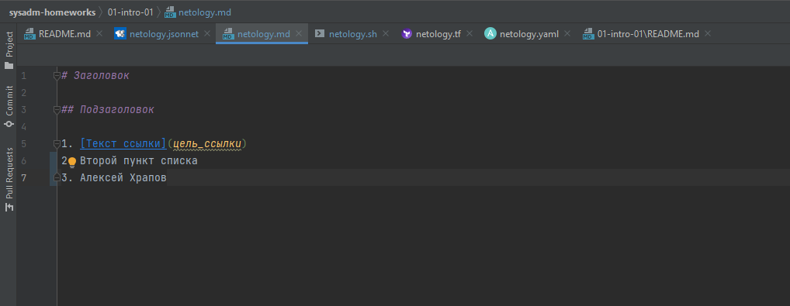
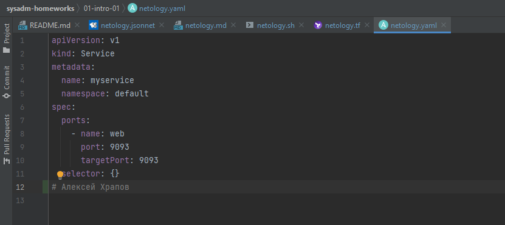
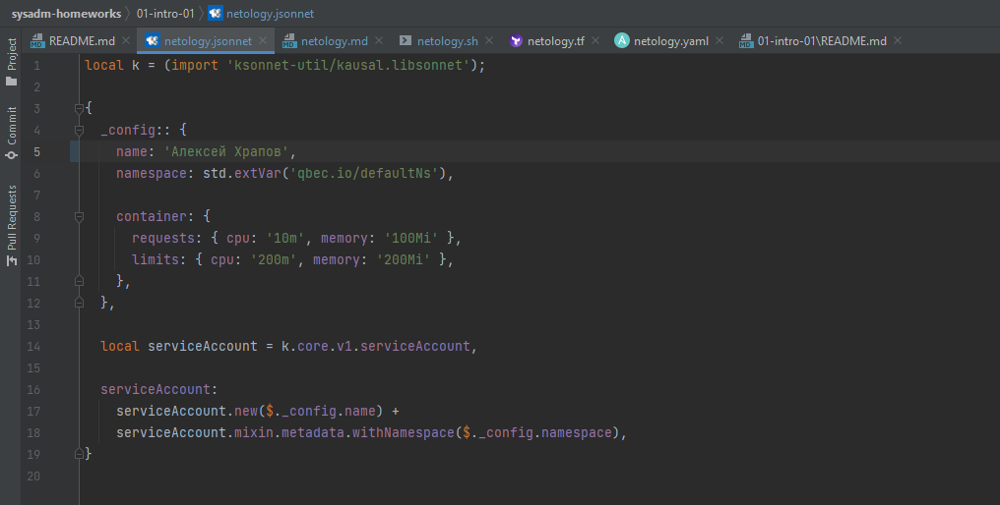

# 1.1. Введение в DevOps — Алексей Храпов
## Задание №1
###Подсветка синтаксиса:
  - Terraform: 
  - Bash: 
  - Markdown: 
  - Yaml: 
  - Jsonnet: 

## Задание №2
### Описание жизненного цикла задачи (разработки нового функционала):
1.	Обработка заказа
- 	Понять суть (Менеджер)
- 	Учесть пожелания клиента (Менеджер)
- 	Договориться о каналах взаимодействия (Менеджер)
- 	Передать заказ в работу (Менеджер)
2.	Анализ
- 	Выбор общих инструментов (Разаработчик(и)+DevOps)
- 	Разграничение зон ответственности и прав доступа (Менеджер+Разаработчик(и)+DevOps)
- 	Постановка (если не были оглашены клиентом) предварительных сроков (Менеджер+Разаработчик(и)+DevOps)
3.	Проектирование
- 	Формирование ТЗ (Менеджер+Разаработчик(и)+DevOps)
- 	Описание среды разработки (Разаработчик(и)+DevOps)
- 	Описание прав доступа (DevOps)
4.	Разработка
- 	Организация среды разработки (необходимое окружение, инструменты, назначение прав доступа, контроля версий) (DevOps)
- 	Организация тесовой среды (возможность тестирования всего проекта, либо отдельных его частей) (DevOps)
- 	Организация мониторинга сред (DevOps)
- 	Реализация нового функционала (Разаработчик(и))
- 	Код-ревью (Разаработчик(и))
- 	Написание тестов/контроль написания тестов (Разаработчик(и)/DevOps)
- 	Автоматизация тестирования (DevOps)
- 	Исправление ошибок, выявленных при тестировании (Разаработчик(и))
5. Тестирование
- 	Прохождение тестов (Тестировщик(и)+DevOps)
- 	Подготовка отчетов о выявленных ошибках (Тестировщик(и)+DevOps)
- 	Проверка соответствия реализации представлениям клиента (Менеджер)
- 	Возвращение на доработку/показ клиенту (Менеджер)
6.	Внедрение
- 	Поддержка (Менеджер+Разаработчик(и)+DevOps)
- 	Доработка (Менеджер+Разаработчик(и)+DevOps)